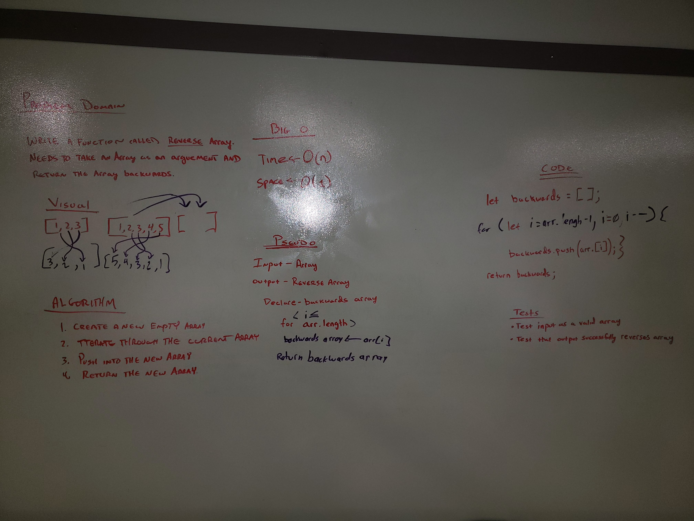

# Reverse an Array
Create an array that will reverse the current array values

## Challenge
Creat a white board and prevent from using .reverse. However, a for loop and adding the values into a new array will complete.

## Solution
